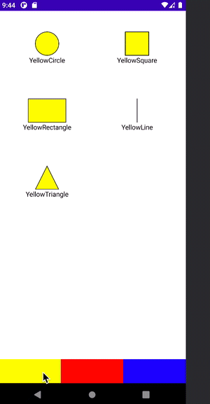

# Figures Conversion

This exercise its based in three main patterns:
- Strategy
- State
- Factory

Strategy it's used for working with colors and figures, as long as they need to interact for changing states and support new colors or shapes.
State pattern works for applying tranformations, a figure with a color can be transformed into another one. 
Factory it's being used to create Colored figures, as long as figures and colors are sum types, the type system allows to know which new transformations needs to be supported.

# Adding a new Color
For adding `Green` as color, a class extending `FigureColor` must be added.
By adding `GreenColor` several colored figured must be created to support the creation of this shapes (`GreenLine`, `GreenSquare`, etc).

# Demo

